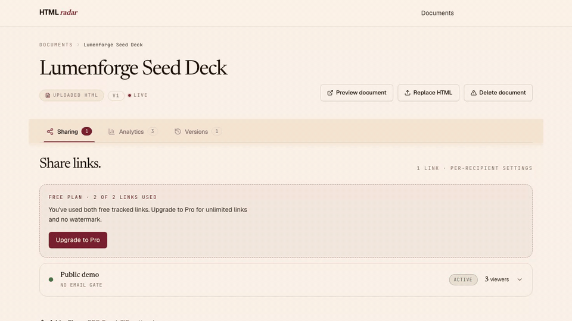

# HTMLRadar

### The open-source DocSend alternative for HTML files.

Read tracking for the HTML your LLM just generated.

[](./LICENSE)
[](https://github.com/htmlradar/htmlradar/stargazers)
[](#quick-start--self-host)
[](https://github.com/htmlradar/htmlradar/issues)

**Send an HTML deck, brief, or proposal as a tracked link. See who opened it,
which sections they actually read, and how long they stayed — not just that it
was opened.**

[htmlradar.com](https://htmlradar.com) · free for 2 tracked links, $15/mo or
$150/yr for unlimited · or self-host the whole thing.

[Issues and PRs](https://github.com/htmlradar/htmlradar/issues) · [roadmap](https://github.com/htmlradar/htmlradar/issues?q=is%3Aissue+label%3Aroadmap) · [changelog](./CHANGELOG.md) documents v1.2; latest published tag is v1.1.2.



<sub>Walkthrough uses synthetic sample data in the real sender dashboard.</sub>

---

## Why this exists

Teams that use LLMs heavily ship more and more of their work as HTML — specs,
reports, dashboards, design mocks, decks. ChatGPT, Claude, v0, Lovable and
Anthropic Artifacts all produce HTML for the things that matter.

The tracking tooling never followed. DocSend and everything like it is built
around uploading a file and tracking that file. PDF was the print-era container.

HTMLRadar tracks the document people actually send now, and reports reading at
section level rather than a single "opened" flag.

---

## What this is

Send-side analytics for HTML documents. Upload an HTML file (or paste a URL you already host), send a tracked link `htmlradar.com/r/{slug}`, see who opened it, which sections they dwelled on, and when they bounced. Section-level dwell, not "opened."

## What it does

- **Section-level dwell — on any HTML.** At least half a section must stay visible for one continuous second before its dwell starts qualifying; the read signal fires after three qualified seconds. The tracker auto-detects sections from your HTML: explicit anchored headings → bare `h1/h2/h3` (slugged from text) → slide/page containers (`section`, `.slide`, `.page`) → paragraph buckets on plain prose. Dashboard tells you a recipient spent 2m 41s on §03 The Ask, 12s on Problem, and skipped Market sizing.
- **Per-viewer dashboard, aggregated across every share.** One row per person who actually opened the doc, with email + country + device + referrer + total time + scroll depth + visits + first/last seen. Updates live every 30 seconds while the tab is in focus.
- **Per-recipient share links.** One document, many shares. Each share carries its own email gate, password, expiry, revocation, and email-domain or per-email allow-list.
- **Files alongside the deck.** Attach PDFs, financial models, images, and ZIPs to any share. Recipients see a small corner pill that opens a side drawer; files are always available when present (the per-share "Lock the deck" toggle controls deck save/print only, never attachments). Every download is logged per viewer + per session + per filename.
- **Version history.** Replace the HTML after partner feedback. Every existing share keeps the same link and serves the new version on next open. The `v{n}` chip on the doc page is a popover with every upload's original local filename, byte size, and timestamp.
- **Retroactive share access.** Change a share's password, expiry, or allow-list without revoking. The proxy re-checks the allow-list on every request — removing an email kicks them out immediately on their next click, not their next browser session.
- **Edit + preview without leaving the dashboard.** Preview the doc as the recipient sees it before sending (short-lived HMAC token, no gate). Both "Preview document" and "Preview as you" open in a new tab so your dashboard stays where you left it.
- **Branded first-open email.** When a recipient creates their first real session, HTMLRadar requests an HTML notification — viewer email + doc title + a single "See the read →" CTA back to the dashboard. Tease, not report.
- **Engaged-time, not tab-open time.** Both per-section dwell and per-session active time apply a 5-second idle watchdog (keydown / scroll / touchstart, mousemove deliberately excluded). Same methodology as Chartbeat / Parse.ly engagement-time. A tab parked while the reader walked away stops counting after 5 seconds.
- **Bot / accidental-tap filter.** After the document loads, HTMLRadar waits through a 5-second warm-up before creating the session. If the recipient backgrounds the tab or bounces during that wait, there is no session, notification request, or inflated viewer count.
- **Privacy-respecting.** Recipient records contain an email when entered or a random browser ID, referrer, coarse device and location data, section dwell, scroll depth, and active time. HTMLRadar stores no raw IP address, keystrokes, mouse positions, DOM snapshots, or session replay. Recipients can opt out via `window.HTMLRadar.optOut()`.

## What it deliberately is not

A sender-side analytics tool for one document at a time. **Not** a CMS, deck builder, static-site host, PDF viewer, or website analytics platform. You bring the HTML.

---

## Architecture

Four packages, two storage backends.

```
htmlradar/
├── packages/
│   ├── tracker/      # ~8 KB gzipped browser IIFE — embedded in the recipient's view
│   ├── proxy/        # Cloudflare Worker at /r/{slug} — gates + HTML fetch + tracker inject + attachment serving
│   ├── app/          # Next.js 14 on Cloudflare Pages — sender's dashboard
│   └── monitor/      # Cloudflare cron Worker — checks Supabase every 5 min and pages the founder on regressions
├── schema/           # Ordered idempotent SQL migrations — tables, RLS, SECURITY DEFINER RPCs, triggers
├── examples/         # Demo HTML for trying it locally
└── docs/             # Architecture, privacy, quickstart, self-hosting
```

Document HTML + attachment bytes live in Cloudflare R2. Everything else (sessions, sections, viewers, shares, attachments metadata, version history) lives in Supabase Postgres.

The architecture decisions — why a Cloudflare Worker proxy, why hand-rolled PostgREST instead of `@supabase/supabase-js`, why per-session bearer tokens instead of HMAC, the engagement-time methodology, the retroactive allow-list — are in [`docs/architecture.md`](./docs/architecture.md).

## Stack

- **Frontend**: Next.js 14 (App Router, Server Components), Tailwind CSS, Newsreader + Geist (self-hosted via `next/font`)
- **Backend**: Supabase Postgres — RLS + SECURITY DEFINER RPCs + `pg_net` triggers for email
- **Proxy**: Cloudflare Worker, HTMLRewriter for tracker injection
- **Storage**: Cloudflare R2 for uploaded HTML
- **Auth**: Supabase Auth (Google OAuth + magic-link)
- **Email**: Resend, invoked from Postgres via `pg_net`
- **Payments**: Polar.sh checkout link (Stripe Connect Express under the hood for Indian indie founders)

Core hosting runs on Cloudflare and Supabase. Resend is optional for notification email, and Polar handles billing for the hosted Pro plan.

---

## Quick start — hosted

1. Sign in at [htmlradar.com](https://htmlradar.com) with Google or magic link.
2. Upload an HTML file or paste a URL.
3. Create a per-recipient share. Email gate / password / expiry / allow-list optional per share.
4. Send the tracked link.
5. Watch the dashboard. HTMLRadar requests a first-read email when the recipient creates their first real session.

Free tier: 2 tracked links lifetime across unlimited documents, 20 attachments per doc up to 25 MB each and 100 MB total per doc. Pro tier ($15/month, or $150/year — two months free): unlimited tracked links, your own link names (`htmlradar.com/r/acme-proposal` rather than a generated one), no "Powered by HTMLRadar" footer on the recipient view, priority support. Coming soon on Pro: custom domain on share URLs, dynamic per-viewer watermark, repeat-open alerts. What's next is on the [public roadmap](https://github.com/htmlradar/htmlradar/issues?q=is%3Aissue+label%3Aroadmap).

## Quick start — self-host

You'll need:

- A Cloudflare account (Workers + R2 + Pages)
- A Supabase project (free tier is enough)
- A domain on Cloudflare DNS
- Node ≥20, PNPM ≥10
- A Resend account for outbound email (optional — without it, the first-read trigger writes a `skipped` row to `notifications_log` and the rest of the product still works)

Then:

```bash
git clone https://github.com/htmlradar/htmlradar
cd htmlradar
pnpm install
cp .env.example .env.local           # fill in keys (Supabase, R2, Resend)
pnpm typecheck && pnpm test          # sanity check
pnpm build                           # build all 4 packages
```

Schema setup: apply every numbered SQL file under `schema/` in numeric order via the Supabase SQL editor. Each migration is idempotent (`CREATE TABLE IF NOT EXISTS`, `CREATE OR REPLACE FUNCTION`, `DO $$ ... IF NOT EXISTS ... $$`), so re-running is safe.

Resend secrets go in Supabase Vault (works on free tier — no `ALTER DATABASE SET` required):

```sql
select vault.create_secret('re_your_resend_api_key', 'resend_api_key');
select vault.create_secret('hello@yourdomain.com',  'resend_from');
```

Full guide with deployment commands in [`docs/self-hosting.md`](./docs/self-hosting.md).

If you modify the source and run a network service from it, AGPL-3.0 requires you to make your modifications available. See [`LICENSE`](./LICENSE).

---

## Development

```bash
pnpm dev                              # runs all 4 packages in parallel
pnpm typecheck                        # tsc --noEmit across packages
pnpm lint                             # eslint + prettier
pnpm test                             # vitest across tracker + proxy
```

Local URLs after `pnpm dev`:

- Web app: `http://localhost:3000`
- Proxy worker: `http://localhost:8787`
- Tracker bundle: `packages/tracker/dist/tracker.js` (after `pnpm --filter @htmlradar/tracker build`)

Tracker bundle size budget: ≤14 KB gzipped. Build will warn if you cross it.

---

## Contributing

PRs welcome. [DCO sign-off](https://developercertificate.org/) is required — just `git commit -s`. No CLA.

- Big features: open an issue first to discuss scope.
- Bug fixes + small improvements: PR directly.
- Style is enforced by `pnpm lint`. CI runs the full suite on every push.

See [`CONTRIBUTING.md`](./CONTRIBUTING.md) for the full guide.

## Security

Found a vulnerability? Email `security@htmlradar.com`. Please don't open a public issue. See [`SECURITY.md`](./SECURITY.md) for the disclosure policy.

## License

AGPL-3.0-or-later. See [`LICENSE`](./LICENSE).

Want to run a hosted service from a closed-source modified version, or embed the tracker in a closed-source product? A **commercial license** is available — see [`COMMERCIAL-LICENSE.md`](./COMMERCIAL-LICENSE.md), or email `hello@htmlradar.com`.

---

Engineering deep-dive: [htmlradar.com/blog/how-we-built-htmlradar](https://htmlradar.com/blog/how-we-built-htmlradar)
